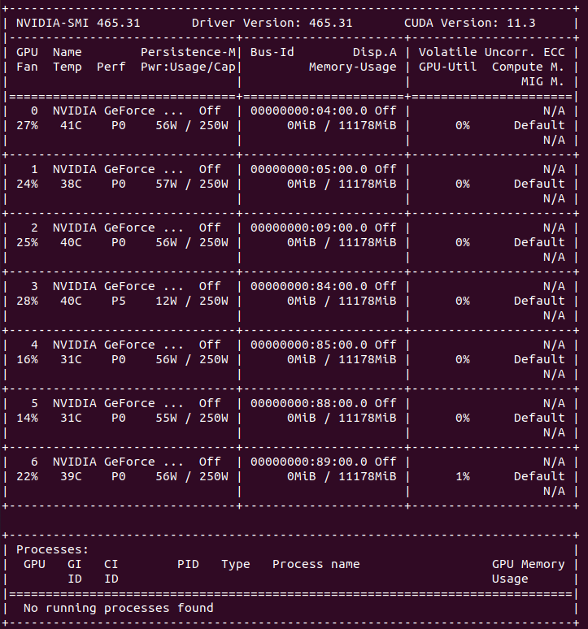

# Enviroment Configuration

## Sys
Static hostname: psdz-SYS-4028GR-TR
Icon name: computer-server
Chassis: server
Machine ID: 526781f0310c4245a40f3971e9213f7d
Boot ID: 2e08b1523d784c18aea8718999402884
Operating System: Ubuntu 16.04.6 LTS
Kernel: Linux 4.4.0-148-generic
Architecture: x86-64
## GPU Configuration
Nvidia-Driver:
```
filename:       /lib/modules/4.4.0-148-generic/kernel/drivers/video/nvidia.ko
alias:          char-major-195-*
version:        465.31
supported:      external
license:        NVIDIA
firmware:       nvidia/465.31/gsp.bin
srcversion:     2E50F34B8EB68035181D0C0
```

CUDA : 11.3
Pytorch : 1.12

## Relative Configuration
